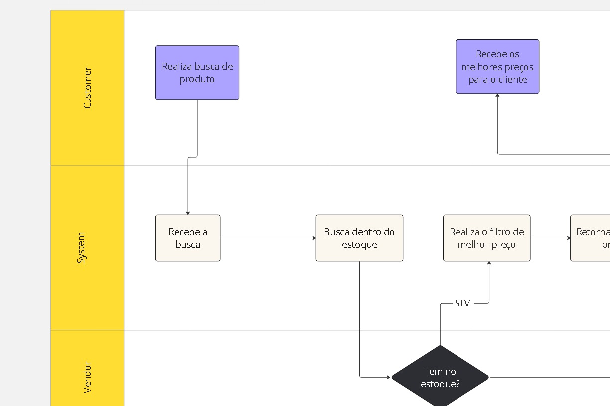
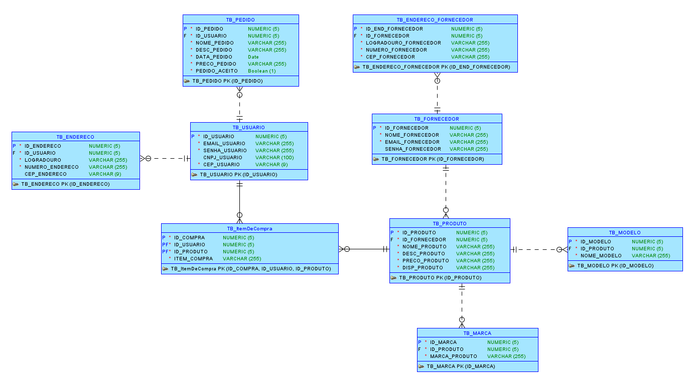

# CHALLENGE  2023 - Projeto UrBuy

# Breve apresentação do grupo: 
* Matheus Martins da Rocha - RM96505 Turma: 2TDSPT(responsável pela entrega de Enterprise APPLICATION DEVELOPMENT e DataBase Application e Data Science)
* Guilherme Raul Varella - RM97166 Turma: 2TDSPT (responsável pela entrega de DevOps Tools e Cloud Computing)
* Pedro Fontanez Bravo - RM97366 Turma: 2TDSPT (responsável pela entrega de Disruptive Architectures IT, IoB e IA)
* Felipe Rios Miranda - RM96726 Turma 2TDSPT (responsável pela entrega de Compliance e Quality Assurance )]
* Augusto de Carvalho Vertolis Santana - RM96518 Turma 2TDSPT (responsável pela entrega de Hybrid Mobile App Development e Digital Business Enablement)

# Objetivo do projeto: 

No mundo cada vez mais complexo do mercado tecnológico, encontrar produtos adequados às necessidades específicas tornou-se um desafio significativo. Nesse contexto, apresentamos nossa proposta tecnológica revolucionária: um sistema de busca personalizado alimentado por um algoritmo inteligente. Esta aplicação visa transformar a experiência de compra de profissionais e entusiastas do setor de tecnologia, simplificando o processo de seleção e economizando tempo valioso.

# Protótipo funcional da aplicação:

# Principal funcionalidade do sistema: 

Nossa aplicação inovadora utiliza um formulário de busca personalizado para ajudar os usuários a encontrarem os produtos mais relevantes em tempo real. Com base nas informações fornecidas, nosso algoritmo inteligente analisa vastas opções disponíveis no mercado tecnológico, apresentando as escolhas mais adequadas de forma instantânea. Essa abordagem centrada no cliente não apenas lista produtos, mas também oferece uma jornada de compra mais inteligente e eficiente.

# Diagrama de classe:

# MODELO DER:

# Link do vídeo de apresentação:

link : https://www.youtube.com/watch?v=kGQI-uOhQRM

