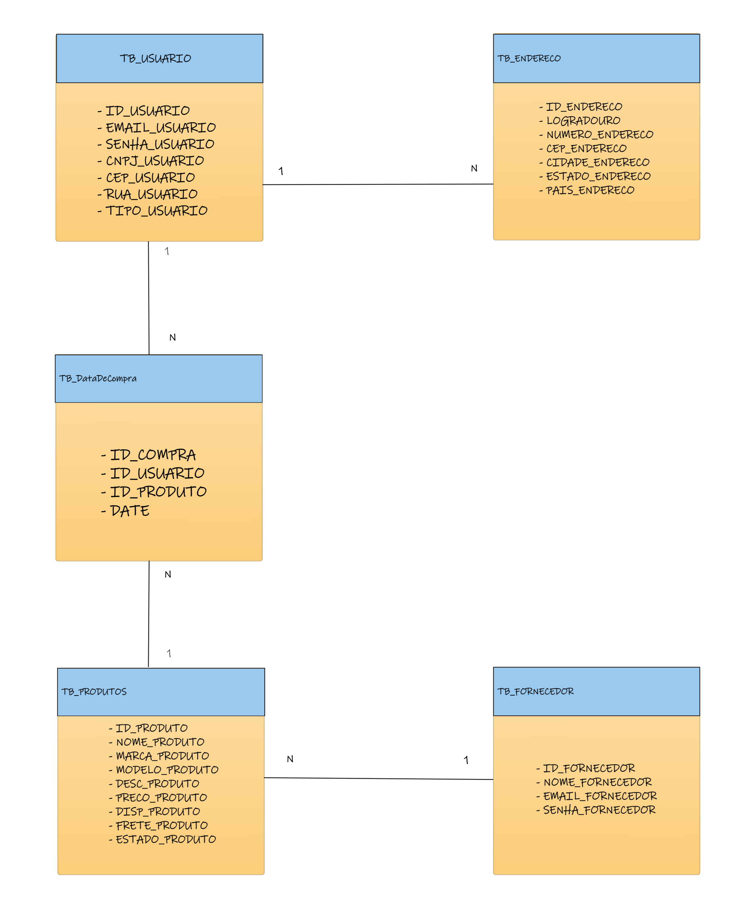

# CHALLENGE  2023 - Projeto UrBuy

Responsável pelo projeto: Matheus Martins da Rocha - RM96505 Turma: 2TDSPT

# Como rodar a aplicação: 

1. Configurar o Arquivo de Configuração:
   Primeiro, você precisa configurar um arquivo chamado persistence.xml. Este arquivo contém informações importantes, como qual banco de dados usar, onde encontrar suas classes de dados, entre outras configurações. É basicamente como você diz ao Java como se conectar ao banco de dados.

2. Criar sua Classe de Dados:
   Você terá uma classe especial que apresenta os dados que você deseja armazenar no banco de dados. Por exemplo, se você estiver criando um aplicativo de gerenciamento de usuarios, sua classe poderia representar um Usuario , com campos como nome, e-mail, etc.

4. Executar e Testar:
   Depois de configurar tudo, você pode rodar seu programa Java. Ele vai começar a conectar com o banco de dados usando as configurações que você definiu, e você poderá ver as operações de banco de dados acontecendo, como adicionar ou buscar dados.   

# Diagrama de classe:

