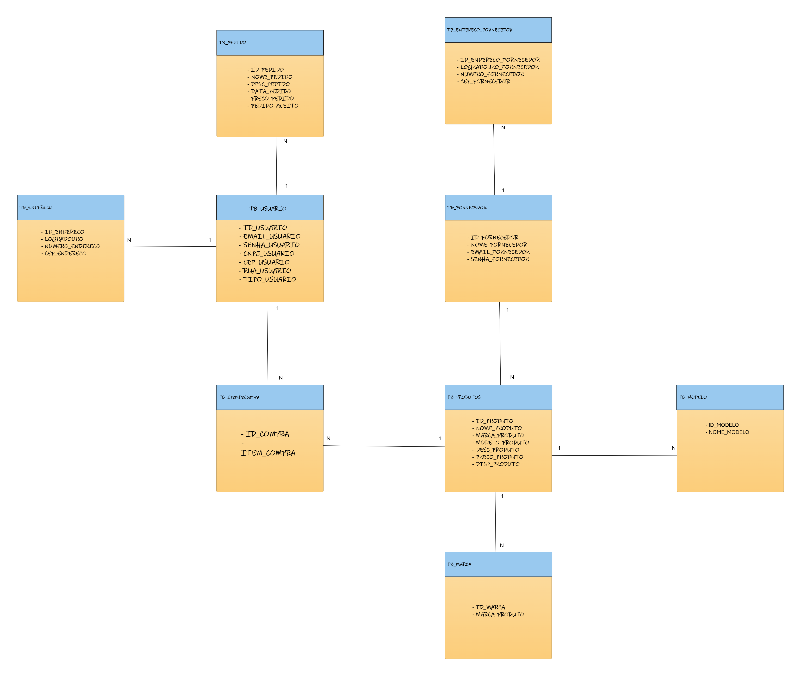

# CHALLENGE  2023 - Projeto UrBuy

# Breve apresentação do grupo: 
* Matheus Martins da Rocha - RM96505 Turma: 2TDSPT(responsável pela entrega de Enterprise APPLICATION DEVELOPMENT e DataBase Application e Data Science)
* Guilherme Raul Varella - RM97166 Turma: 2TDSPT (responsável pela entrega de DevOps Tools e Cloud Computing)
* Pedro Fontanez Bravo - RM97366 Turma: 2TDSPT (responsável pela entrega de Disruptive Architectures IT, IoB e IA)
* Felipe Rios Miranda - RM96726 Turma 2TDSPT (responsável pela entrega de Compliance e Quality Assurance )]
* Augusto de Carvalho Vertolis Santana - RM96518 Turma 2TDSPT (responsável pela entrega de Hybrid Mobile App Development e Digital Business Enablement)

# Como rodar a aplicação: 

Abra o Projeto no Seu IDE:

* Inicie o seu Ambiente de Desenvolvimento Integrado (IDE) favorito.
Importe o projeto para o IDE, selecionando a opção de importação ou abertura de projeto, dependendo das funcionalidades do seu IDE.
Navegue até a Classe Main:

* No seu IDE, vá até a pasta src/main/java/br.com.fiap.
Dentro dessa pasta, você encontrará a classe principal chamada Main.java. Abra esta classe para explorar o código-fonte.
Acesse o Arquivo persistence.xml para Configurar o Banco de Dados:

* Vá até a pasta src/main/resources/META-INF.
Dentro dessa pasta, abra o arquivo persistence.xml para configurar as propriedades de acesso ao banco de dados. Aqui, você pode ajustar o nome de usuário, senha e outras configurações necessárias para o seu banco de dados Oracle.

    Por exemplo:

* Dentro da classe Main.java, certifique-se de que a constante PERSISTENCE_UNIT esteja definida corretamente para o nome do seu persistenceUnit.
  Por exemplo

# Executar e Testar a Aplicação:

* No arquivo Main.java, você encontrará um método main. Este é o ponto de entrada da aplicação.
Clique com o botão direito do mouse no arquivo Main.java e escolha a opção "Run" para executar a aplicação. Alternativamente, procure na parte superior da tela um ícone de "play" para iniciar a execução.
Esses passos devem ajudar a executar e testar a aplicação localmente em seu ambiente de desenvolvimento. Certifique-se de que o banco dados está disponível e que as configurações do persistence.xml estejam corretas.

# Diagrama de classe:

# MODELO DER:

# Link do vídeo de apresentação:

link : https://www.youtube.com/watch?v=kGQI-uOhQRM

